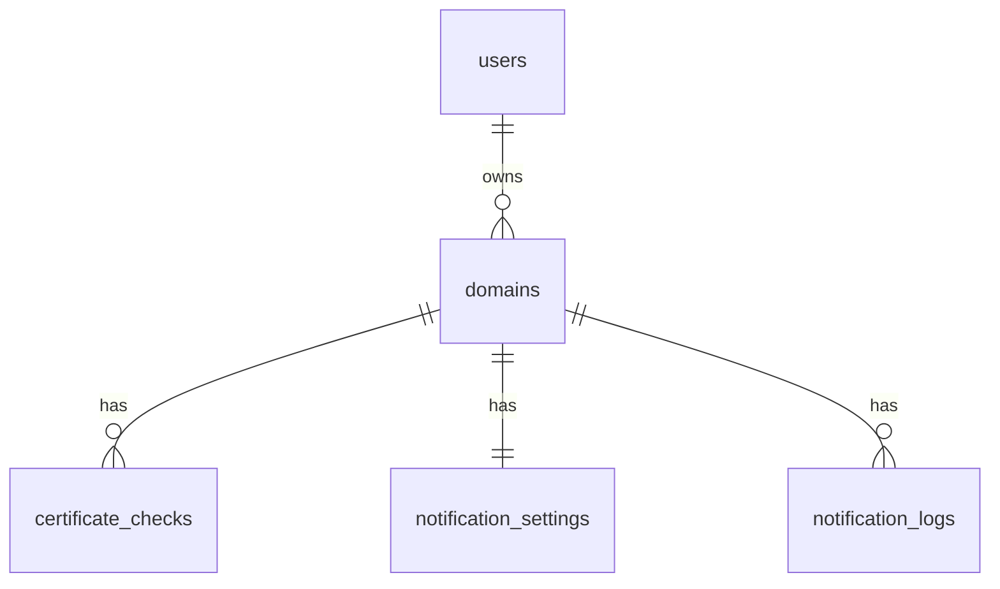

# SSLMon Project Overview

## What Is SSLMon?

SSLMon is a web-based SaaS platform for monitoring SSL certificates across public-facing domains. It helps developers, small agencies, founders, and website owners track certificate health and receive email alerts before certificates expire.

The goal of the MVP is to provide a simple, reliable, developer-focused dashboard that makes SSL expiry easy to see and hard to miss.

---

## Problem

SSL certificates expire on fixed schedules, but many website owners still track them manually or forget about them entirely. When a certificate expires, users may see browser security warnings, trust indicators can break, and the website may appear unsafe or unavailable.

SSLMon solves this by continuously checking registered domains and notifying users before expiry becomes a problem.

---

## Product Vision

SSLMon should become a lightweight, trustworthy SSL monitoring tool for people who manage multiple websites.

The MVP focuses on three core outcomes:

- Give users clear visibility into SSL certificate health.
- Send timely email notifications before certificates expire.
- Keep the product simple enough to build, ship, and improve quickly.

---

## MVP Goals

- Allow users to register and manage domains.
- Run hourly SSL certificate checks for active domains.
- Store certificate check history.
- Display certificate health and expiry status in a dashboard.
- Send email alerts based on notification thresholds.
- Enforce Free and Pro plan limits.
- Support both email/password authentication and GitHub OAuth.

---

## MVP Non-Goals

The initial release will not include:

- Native mobile apps.
- Multi-user teams or organisation workspaces.
- Internal/private CA certificate support.
- Automatic certificate renewal.
- Advanced alerting channels such as Slack, SMS, or webhooks.

---

## Target Users

SSLMon is aimed at technically minded users and small businesses that manage one or more websites.

Primary users include:

- Freelance developers managing client websites.
- Small agencies responsible for multiple domains.
- Indie hackers and startup founders with several projects.
- Solo website owners who want a simple way to avoid missed renewals.

---

## Pricing Plans

| Feature | Free | Pro |
|---|---:|---:|
| Price | $0/month | $10/month |
| Domain limit | 3 domains | 25 domains |
| Monitoring frequency | Daily | Daily |
# SSLMon Project Overview

## What Is SSLMon?

SSLMon is a web-based SaaS platform for monitoring SSL certificates across public-facing domains. It helps developers, small agencies, founders, and website owners track certificate health and receive email alerts before certificates expire.

The goal of the MVP is to provide a simple, reliable, developer-focused dashboard that makes SSL expiry easy to see and hard to miss.

---

## Problem

SSL certificates expire on fixed schedules, but many website owners still track them manually or forget about them entirely. When a certificate expires, users may see browser security warnings, trust indicators can break, and the website may appear unsafe or unavailable.

SSLMon solves this by continuously checking registered domains and notifying users before expiry becomes a problem.

---

## Product Vision

SSLMon should become a lightweight, trustworthy SSL monitoring tool for people who manage multiple websites.

The MVP focuses on three core outcomes:

- Give users clear visibility into SSL certificate health.
- Send timely email notifications before certificates expire.
- Keep the product simple enough to build, ship, and improve quickly.

---

## MVP Goals

- Allow users to register and manage domains.
- Run Daily SSL certificate checks for active domains.
- Store certificate check history.
- Display certificate health and expiry status in a dashboard.
- Send email alerts based on notification thresholds.
- Enforce Free and Pro plan limits.
- Support both email and password authentication and GitHub OAuth.

---

## Target Users

SSLMon is aimed at technically minded users and small businesses that manage one or more websites.

Primary users include:

- Freelance developers managing client websites.
- Small agencies responsible for multiple domains.
- Indie hackers and startup founders with several projects.
- Solo website owners who want a simple way to avoid missed renewals.

---

## Pricing Plans

| Feature | Free | Pro | Enterprize
|---|---:|---:|
| Price | $0/month | $10/month | $50/month
| Domain limit | 3 domains | 50 domains | 200
| Monitoring frequency | Daily | Daily | Daily
| Notifications | Fixed thresholds | Fixed + custom thresholds |

### Free Plan

The Free plan is for individuals who want to monitor a few personal projects or test the product before upgrading.

### Pro Plan

The Pro plan is for developers and small agencies managing more domains and needing more flexible notification settings.

---
## EnterPrise Plan
This plan is for people who have a lot of websites to monitor and need more flexibility 

## Core Features

### 1. Authentication

Users can create and access accounts using:

- Email/password registration and login.
- GitHub OAuth via Laravel Socialite.

Authentication uses Laravel cookie-based sessions with CSRF protection. Email verification is required before a user can add domains.

### 2. Domain Management

Users can:

- Add a domain by hostname, such as `example.com`.
- Add an optional friendly label or nickname.
- Edit domain details.
- Pause monitoring without deleting the domain.
- Remove a domain and its related notification history.

When a domain is added, SSLMon immediately performs an initial SSL check.

Domain limits are enforced by plan:

- Free: 3 domains.
- Pro: 25 domains.

When Free users hit their limit, the UI should show a clear upgrade prompt.

### 3. SSL Monitoring

SSLMon runs an hourly scheduled monitoring job through Laravel's task scheduler.

For each active domain, the system performs a TLS handshake and captures certificate metadata.

Each check records:

- Certificate expiry date.
- Certificate issuer/authority.
- Whether the certificate is valid.
- Any connection or validation errors.
- Timestamp of the check.

The system stores the raw expiry date. `days_remaining` is not stored; it is calculated when needed from the latest expiry date.

If a check fails because of DNS issues, connection refusal, or another error, the domain is marked with a failed status and the user is notified by email.

### 4. Expiry Dashboard

The dashboard gives users a visual overview of all monitored domains.

It should show:

- Domain hostname.
- Friendly label.
- Last check status.
- Last checked time.
- Certificate expiry date.
- Days remaining.
- Notification threshold.
- Monitoring state: active or paused.

The dashboard should make risky domains easy to spot.

### 5. Email Notifications

Each domain has one active notification threshold.

When the calculated days remaining is at or below that threshold, SSLMon sends an email notification.

Notification rules:

- Free users can choose one fixed threshold: 30, 15, 7, or 1 day.
- Pro users can choose a fixed threshold or enter a custom number of days.
- Only one notification is sent per domain per expiry cycle for the active threshold.
- Notification history is stored and visible in the dashboard.

Emails are sent using Laravel Mail and Resend.

Each email should include:

- Domain name.
- Expiry date.
- Days remaining.
- Current certificate status.
- Direct link to the domain's dashboard entry.

---

## Technical Stack

| Layer | Technology |
|---|---|
| Backend | Laravel 12 REST API |
| Frontend | Vue.js Options API SPA |
| State Management | Vuex |
| Routing | Vue Router |
| Database | MySQL |
| Queue Driver | Laravel database queue |
| Scheduler | Laravel Task Scheduler + cron |
| Email | Laravel Mail + Resend |
| SSL Checks | PHP `stream_socket_client()` and/or `openssl_x509_parse()` |
| Auth | Cookie-based sessions + GitHub OAuth |

---

## Core Data Model

### `users`

Stores user account and authentication details.

Fields:

- `id`
- `name`
- `email`
- `password`
- `github_id`
- `email_verified_at`
- `remember_token`
- `created_at`
- `updated_at`

### `domains`

Stores domains owned by users.

Fields:

- `id`
- `user_id`
- `hostname`
- `label`
- `is_active`
- `last_checked_at`
- `last_status`
- `created_at`
- `updated_at`

### `certificate_checks`

Stores historical SSL check results.

Fields:

- `id`
- `domain_id`
- `checked_at`
- `issuer`
- `expiry_date`
- `is_valid`
- `error_message`

### `notification_settings`

Stores each domain's active notification threshold.

Fields:

- `id`
- `domain_id`
- `threshold_days`
- `created_at`
- `updated_at`

A domain has one notification setting. If the row exists, notification checking is active for that domain.

### `notification_logs`

Stores sent notification history.

Fields:

- `id`
- `domain_id`
- `threshold_days`
- `sent_at`
- `email_address`

---

## Entity Relationships

---

## MVP Release Scope

The first release should ship with:

- Email/password authentication.
- GitHub OAuth authentication.
- Email verification.
- Password reset.
- Domain add/edit/remove.
- Domain pause/resume monitoring.
- Plan-based domain limits.
- Hourly SSL monitoring job.
- Certificate check history.
- Expiry dashboard.
- Single-threshold email notifications.
- Notification log per domain.
- Free and Pro plan enforcement.

---

## Open Questions

### Plan Downgrades

How should SSLMon handle users who downgrade from Pro to Free while already having more than 3 domains?

Possible options:

- Pause excess domains automatically.
- Let users choose which domains remain active.
- Continue showing domains but block new checks until the account is under the limit.

### Queue Scaling

Hourly checks may become expensive as the number of domains grows. The queue system should be designed so monitoring jobs can be batched and scaled later.

### Monitoring Frequency

Hourly checks are acceptable for the MVP, but SSL certificates do not usually require hourly monitoring. The frequency can be revisited after real usage data is available.

---

## Suggested Build Order

1. Build authentication.
2. Add email verification gating.
3. Build domain CRUD.
4. Enforce plan domain limits.
5. Implement the SSL check service.
6. Run an initial check when a domain is added.
7. Store check results in `certificate_checks`.
8. Build the dashboard using the latest check per domain.
9. Add notification settings per domain.
10. Implement notification sending and logging.
11. Add the hourly scheduler and queue processing.
12. Polish the UI and empty/error states.

---

## MVP Success Criteria

The MVP is successful when a user can:

- Register and verify their email.
- Add a public domain.
- See the SSL certificate expiry date and status.
- Receive an email before the certificate expires.
- View notification history.
- Upgrade when they need to monitor more domains.

| Notifications | Fixed thresholds | Fixed + custom thresholds |

### Free Plan

The Free plan is for individuals who want to monitor a few personal projects or test the product before upgrading.

### Pro Plan

The Pro plan is for developers and small agencies managing more domains and needing more flexible notification settings.

---

## Core Features

### 1. Authentication

Users can create and access accounts using:

- Email/password registration and login.
- GitHub OAuth via Laravel Socialite.

Authentication uses Laravel cookie-based sessions with CSRF protection. Email verification is required before a user can add domains.

### 2. Domain Management

Users can:

- Add a domain by hostname, such as `example.com`.
- Add an optional friendly label or nickname.
- Edit domain details.
- Pause monitoring without deleting the domain.
- Remove a domain and its related notification history.

When a domain is added, SSLMon immediately performs an initial SSL check.

Domain limits are enforced by plan:

- Free: 3 domains.
- Pro: 25 domains.

When Free users hit their limit, the UI should show a clear upgrade prompt.

### 3. SSL Monitoring

SSLMon runs an hourly scheduled monitoring job through Laravel's task scheduler.

For each active domain, the system performs a TLS handshake and captures certificate metadata.

Each check records:

- Certificate expiry date.
- Certificate issuer/authority.
- Whether the certificate is valid.
- Any connection or validation errors.
- Timestamp of the check.

The system stores the raw expiry date. `days_remaining` is not stored; it is calculated when needed from the latest expiry date.

If a check fails because of DNS issues, connection refusal, or another error, the domain is marked with a failed status and the user is notified by email.

### 4. Expiry Dashboard

The dashboard gives users a visual overview of all monitored domains.

It should show:

- Domain hostname.
- Friendly label.
- Last check status.
- Last checked time.
- Certificate expiry date.
- Days remaining.
- Notification threshold.
- Monitoring state: active or paused.

The dashboard should make risky domains easy to spot.

### 5. Email Notifications

Each domain has one active notification threshold.

When the calculated days remaining is at or below that threshold, SSLMon sends an email notification.

Notification rules:

- Free users can choose one fixed threshold: 30, 15, 7, or 1 day.
- Pro users can choose a fixed threshold or enter a custom number of days.
- Only one notification is sent per domain per expiry cycle for the active threshold.
- Notification history is stored and visible in the dashboard.

Emails are sent using Laravel Mail and Resend.

Each email should include:

- Domain name.
- Expiry date.
- Days remaining.
- Current certificate status.
- Direct link to the domain's dashboard entry.

---

## Technical Stack

| Layer | Technology |
|---|---|
| Backend | Laravel 12 REST API |
| Frontend | Vue.js Options API SPA |
| State Management | Vuex |
| Routing | Vue Router |
| Database | MySQL |
| Queue Driver | Laravel database queue |
| Scheduler | Laravel Task Scheduler + cron |
| Email | Laravel Mail + Resend |
| SSL Checks | PHP `stream_socket_client()` and/or `openssl_x509_parse()` |
| Auth | Cookie-based sessions + GitHub OAuth |

---

## Core Data Model

### `users`

Stores user account and authentication details.

Fields:

- `id`
- `name`
- `email`
- `password`
- `github_id`
- `email_verified_at`
- `remember_token`
- `created_at`
- `updated_at`

### `domains`

Stores domains owned by users.

Fields:

- `id`
- `user_id`
- `hostname`
- `label`
- `is_active`
- `last_checked_at`
- `last_status`
- `created_at`
- `updated_at`

### `certificate_checks`

Stores historical SSL check results.

Fields:

- `id`
- `domain_id`
- `checked_at`
- `issuer`
- `expiry_date`
- `is_valid`
- `error_message`

### `notification_settings`

Stores each domain's active notification threshold.

Fields:

- `id`
- `domain_id`
- `threshold_days`
- `created_at`
- `updated_at`

A domain has one notification setting. If the row exists, notification checking is active for that domain.

### `notification_logs`

Stores sent notification history.

Fields:

- `id`
- `domain_id`
- `threshold_days`
- `sent_at`
- `email_address`

---

## Entity Relationships

---

## MVP Release Scope

The first release should ship with:

- Email/password authentication.
- GitHub OAuth authentication.
- Email verification.
- Password reset.
- Domain add/edit/remove.
- Domain pause/resume monitoring.
- Plan-based domain limits.
- Hourly SSL monitoring job.
- Certificate check history.
- Expiry dashboard.
- Single-threshold email notifications.
- Notification log per domain.
- Free and Pro plan enforcement.

---

## Open Questions

### Plan Downgrades

How should SSLMon handle users who downgrade from Pro to Free while already having more than 3 domains?

Possible options:

- Pause excess domains automatically.
- Let users choose which domains remain active.
- Continue showing domains but block new checks until the account is under the limit.

### Queue Scaling

Hourly checks may become expensive as the number of domains grows. The queue system should be designed so monitoring jobs can be batched and scaled later.

### Monitoring Frequency

Hourly checks are acceptable for the MVP, but SSL certificates do not usually require hourly monitoring. The frequency can be revisited after real usage data is available.

---

## Suggested Build Order

1. Build authentication.
2. Add email verification gating.
3. Build domain CRUD.
4. Enforce plan domain limits.
5. Implement the SSL check service.
6. Run an initial check when a domain is added.
7. Store check results in `certificate_checks`.
8. Build the dashboard using the latest check per domain.
9. Add notification settings per domain.
10. Implement notification sending and logging.
11. Add the hourly scheduler and queue processing.
12. Polish the UI and empty/error states.

---

## MVP Success Criteria

The MVP is successful when a user can:

- Register and verify their email.
- Add a public domain.
- See the SSL certificate expiry date and status.
- Receive an email before the certificate expires.
- View notification history.
- Upgrade when they need to monitor more domains.
